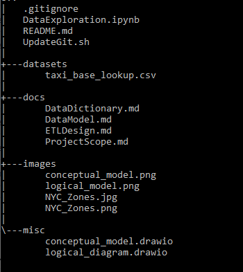
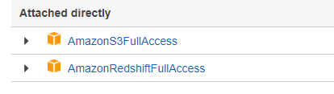
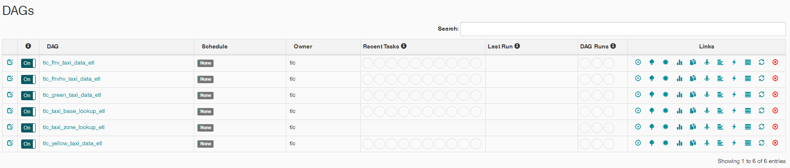

## Udacity Capstone Project - TLC Taxi trips Data Warehouse Project


**Name: Darren Foley**

**Creation Date: 2021-10-21**

**Last Modified Data: 2021-11-13**

-------------------------------------------------------

### Documentation

1. Project Setup

2. [Project Scope](docs/ProjectScope.md) 

3. [Data Dictionary](docs/DataDictionary.md)

4. [Data Model](docs/DataModel.md)

5. [ETL Design](docs/ETLDesign.md) 


<br>

### Project Index




<br>

### Project Setup

**Versioning & Compatiblity**

<p>Airflow DAG's were written and tested in ubuntu 16.04 VM running Airflow version 1.10.2 installed in python 3.6</p>

```
# uname -a 
Linux 0ed8a3d2ab28 4.15.0-1098-gcp #111~16.04.1-Ubuntu SMP Tue Apr 13 19:05:08 UTC 2021 x86_64 x86_64 x86_64 GNU/Linux
```


```
# airflow version
  ____________       _____________
 ____    |__( )_________  __/__  /________      __
____  /| |_  /__  ___/_  /_ __  /_  __ \_ | /| / /
___  ___ |  / _  /   _  __/ _  / / /_/ /_ |/ |/ /
 _/_/  |_/_/  /_/    /_/    /_/  \____/____/|__/
   v1.10.2
```

```
# python --version
Python 3.6.3
```

<br>

**Prerequisites**

<p>There are a number of prerequisites required before the Airflow pipelines can be run.</p>

1. Create an AWS User

<p>Create an AWS user that has permission to copy data from S3 into redshift. The user should also have permissions to connect and query redshift. For simplicity you can add the below policies. </p>




2. Update the aws-master.cfg file located at /airflow/dags/aws-master.cfg with your AWS user key & secret key.

<p>The setup.py script depends upon the config being set before running.</p>

<br>

**Run setup.py (Optional)**

<p>Within the Airflow folder there is a setup file (/airflow/setup.py) which should handle all of the airflow DAG dependencies. Just run from your command line environment as shown:</p>

```
# python ./setup.py "your-local-bucket-name"
```

This script does two things:

1. Installs Python Packages

<p>The ETL pipelines process and load geometric shape data which relies on the geopandas (geopandas==0.9.0) package in python 3.6. This must be installed before the DAG's can run correctly. The newest version of pip must also be upgraded before installation. </p>

```
pip install --upgrade pip

pip install geopandas

```

2. Creates an S3 Staging Bucket

<p>The next dependency is to create a local S3 bucket to hold lookup data before being loaded into Redshift. This will act as a staging area for shape files. Remember that the bucket name must be set in airflow UI before DAGS can be run. </p>

<p>Either perform the above steps manually or just run the setup script.</p>

<br>

**Create the Redshift Cluster**

<p>As described within the project scope, the design requires a ra3.xlplus RA3 node cluster. Use the "create_cluster.sh" script in project root to spin up the cluster before running the DAGs. Either setup a cluster manually through the AWS console or run the create_cluster script.</p>

```
# ./create_cluster.sh -h
./create_cluster.sh [-h|help] [-T|testing] [-P|production] [-d|delete] <cluster-identifier>

# ./create_cluster.sh -P
creating cluster......
```

<br>

**Set Airflow Connections**

1. AWS User

<p>You'll need to add your AWS user which has access to load data into Redshift from S3. These credentials must be be set in the airflow UI as "aws", which will be picked up by the dags during execution.</p>


2. Redshift Hostname

<p>The redshift Hostname will need to be added into the Airflow UI as "redshift", which will be picked up by the dags during execution. </p>


**Set Variables Parameters**

1. S3 Local Bucket Name

<p>As mentioned above, set the bucket name variable as "local_bucket"="your-bucket-name", which will be picked up by the dags during execution. </p>


2. Add HOME_ variable to indicate DAG home directory

<p>Location of the Home directory where dags are located. (Default: /home/workspace/airflow/dags)</p>

<br>

### Running Airflow Pipelines

<p>Once all of the above has been created, you can run the dags from the airflow UI. In production, the dags will run on a monthly schedule, however by default they are set to run for March 2020 only. This is just for testing purposes to prove that the pipelines are working. So you will need to trigger than manually from the UI to test. </p>

<p>Switch on all DAGs as shown below and run either yellow, green, fhv or fhv_hv pipelines which are the primary dags. Taxi zone and base are triggered by the other DAG's. Note that due to the size of the fhv_hv source file (tens of millions of rows) it can take up to +3 hours to load the data for this one. Yellow, green or fhv all should process a much faster. </p>


