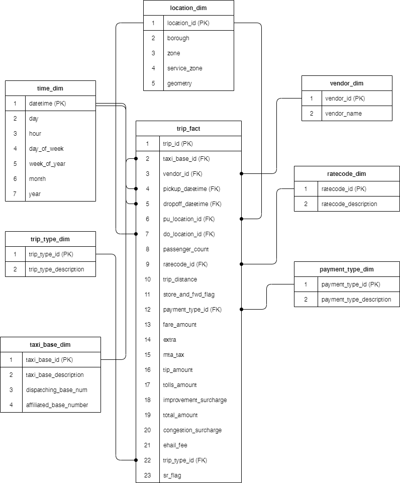

## Data Model

-----------------------

### Navigation

1. [Project Setup](../README.md)

2. [Project Scope](ProjectScope.md) 

3. [Data Dictionary](DataDictionary.md)

4. Data Model

5. [ETL Design](ETLDesign.md) 

<br>

### 5.0 Data Model

<p>The data model will have a traditional kimball star schema design with a single fact table recording trip events, a single event corresponding to each row of data. There will be seven dimensions in total -> time, location/zone, vendor, rate, payment type, taxi base, trip type. The data does not have a unique identifier for each trip across all taxi base types so a surrogate key will be generated. In order for the FHV datasets to fit with the yellow and green taxi datasets, fields will need to be merged and extra data will need to be added from the Uber API. These datasets did not contain any information relating to fairs or charges. This will need to be estimated using the Uber api and added to the datasets during the ETL process.</p>

<br>

#### 5.1 Conceptual model


*Diagram shows a rough conceptual model of proposed facts and dimensions*


**Notes of interest:**

<p>Since there is hierarchical relationship between borough and zone (one borough has many zones), a snowflake configuration could have been used. However the amount of zones is relatively small, the risk of write anonomalies is low and thus a denormalized dimension is sufficient here.</p>

<p>The location/zone dimension will be referenced twice by foreign key, once for pick up location and again for drop off location.</p> 

<p>Time will be split into month, day, hour , day of week, day of month</p>

<br>

#### 5.2 Logical Model



*Diagram shows the logical model of proposed facts and dimensions*

<br>

#### 5.3 Physical Model


1. public.time_dim

```
CREATE TABLE IF NOT EXISTS public.time_dim (
        event_datetime datetime NOT NULL,
        "hour" int4,
        "day" int4,
        week int4,
        "month" int4,
        "year" int4,
        day_of_week int4,
        insertion_datetime datetime NOT NULL,
        CONSTRAINT time_pkey PRIMARY KEY (event_datetime)
        );  
```

2. public.location_dim

```
CREATE TABLE IF NOT EXISTS public.location_dim (
        location_key_id int4 NOT NULL,
        location_id int4 NOT NULL,
        zone varchar(255) NOT NULL,
        borough varchar(255) NOT NULL,
        geometry GEOMETRY NOT NULL,
        insertion_datetime datetime NOT NULL,
        CONSTRAINT location_pkey PRIMARY KEY (location_key_id)
        );
```

3. public.vendor_dim

```
CREATE TABLE IF NOT EXISTS public.vendor_dim (
        vendor_key_id int4 NOT NULL, 
        vendor_id int4 NOT NULL,
        vendor_description varchar(255) NOT NULL,
        insertion_datetime datetime NOT NULL,
        CONSTRAINT vendor_pkey PRIMARY KEY (vendor_key_id)
     );
```

4. public.trip_type_dim

```
CREATE TABLE IF NOT EXISTS public.trip_type_dim (
        trip_type_key_id int4 NOT NULL,
        trip_type_id int4 NOT NULL,
        trip_type_description varchar(255) NOT NULL,
        insertion_datetime datetime NOT NULL,
        CONSTRAINT trip_type_pkey PRIMARY KEY (trip_type_key_id)
    );
```

5. public.ratecode_dim

```
CREATE TABLE IF NOT EXISTS public.ratecode_dim (
        ratecode_key_id int4 NOT NULL,
        ratecode_id int4 NOT NULL,
        ratecode_description varchar(255) NOT NULL,
        insertion_datetime datetime NOT NULL,
        CONSTRAINT ratecode_pkey PRIMARY KEY (ratecode_key_id)
    );
```

6. public.taxi_base_dim

```
CREATE TABLE IF NOT EXISTS public.taxi_base_dim (
        taxi_base_key_id varchar(255) NOT NULL, --license_number
        taxi_base_description varchar(255) NOT NULL,
        -- license_number varchar(255) NOT NULL,
        high_volume_license_number varchar(255),
        base_name varchar(255) NOT NULL,
        app_company_affiliation varchar(255) NOT NULL,
        insertion_datetime datetime NOT NULL,
        CONSTRAINT taxi_base_pkey PRIMARY KEY (taxi_base_key_id)
    );
```

7. public.payment_type_dim

```
CREATE TABLE IF NOT EXISTS public.payment_type_dim (
        payment_type_key_id int4 NOT NULL,
        payment_type_id int4 NOT NULL,
        payment_type_description varchar(255) NOT NULL,
        insertion_datetime datetime NOT NULL,
        CONSTRAINT payment_type_pkey PRIMARY KEY (payment_type_key_id)
     );
```

8. public.trip_fact

```
CREATE TABLE IF NOT EXISTS public.trip_fact (
        trip_key_id bigint IDENTITY(1,1) NOT NULL,
        taxi_base_key_id varchar(50) NOT NULL,
        vendor_key_id int4 NOT NULL,
        pickup_datetime datetime NOT NULL,
        dropoff_datetime datetime NOT NULL,
        pu_location_key_id int4 NOT NULL,
        do_location_key_id int4 NOT NULL,
        passenger_count int4,
        ratecode_key_id int4 NOT NULL,
        trip_duration decimal(19,11),
        trip_distance decimal(19,11),
        store_and_fwd_flag int4,
        payment_type_key_id int4 NOT NULL,
        fare_amount decimal(19,11),
        extra decimal(19,11),
        mta_tax decimal(19,11),
        tip_amount decimal(19,11),
        tolls_amount decimal(19,11),
        improvement_surcharge decimal(19,11),
        total_amount decimal(19,11),
        congestion_surcharge decimal(19,11),
        ehail_fee decimal(19,11),
        trip_type_key_id int4 NOT NULL,
        insertion_datetime datetime NOT NULL,
        CONSTRAINT trip_pkey PRIMARY KEY (trip_key_id),
        FOREIGN KEY(taxi_base_key_id) REFERENCES public.taxi_base_dim(taxi_base_key_id),
        FOREIGN KEY(vendor_key_id) REFERENCES public.vendor_dim(vendor_key_id),
        FOREIGN KEY(pickup_datetime) REFERENCES public.time_dim(event_datetime),
        FOREIGN KEY(dropoff_datetime) REFERENCES public.time_dim(event_datetime),
        FOREIGN KEY(pu_location_key_id) REFERENCES public.location_dim(location_key_id),
        FOREIGN KEY(do_location_key_id) REFERENCES public.location_dim(location_key_id),
        FOREIGN KEY(ratecode_key_id) REFERENCES public.ratecode_dim(ratecode_key_id),
        FOREIGN KEY(payment_type_key_id) REFERENCES public.payment_type_dim(payment_type_key_id),
        FOREIGN KEY(trip_type_key_id) REFERENCES public.trip_type_dim(trip_type_key_id)
        );
```