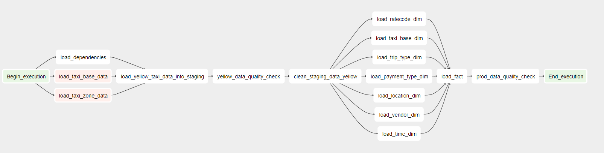
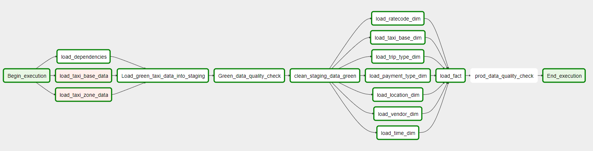
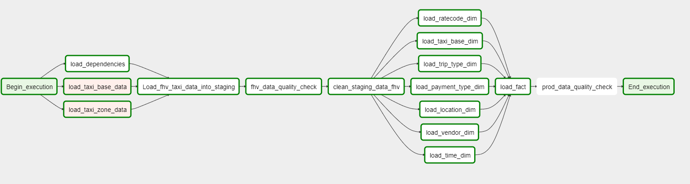
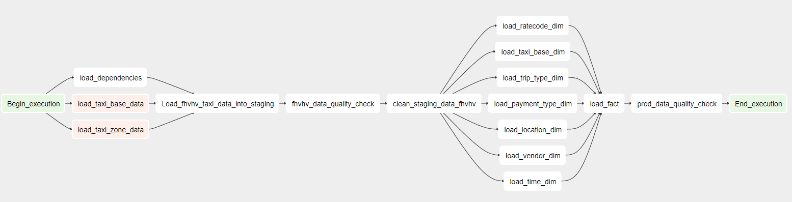
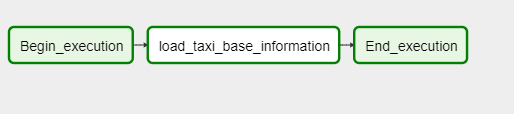
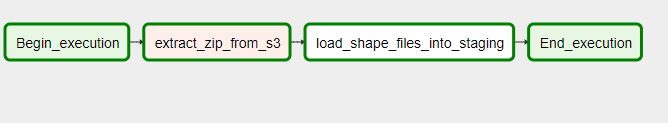

## ETL Design

-----------------------

### Navigation

1. [Project Setup](../README.md)

2. [Project Scope](ProjectScope.md) 

3. [Data Dictionary](DataDictionary.md)

4. [Data Model](DataModel.md)

5. ETL Design

<br>

### 6.0 ETL Design

<p>The legacy ETL codebase is custom written python code using pandas/numpy and SQL to tranform the data and write output to destination tables in Postgres. There are numerious difficulties maintaining the legacy codebase and it does not have any UI to help flag issues quickly. Apache Airflow will be implemented as the main orchestration tool to help improve code maintainability and provide a single consistent programming model in which to define the ETL pipelines. The Airflow cluster will be deployed and hosted in AWS. However, over time the DAGS will be migrated to "Amazon Managed Workflows for Apache Airflow" (MWAA) but this is out of scope for the inital phase of the project.</p>

<p>As discussed in the project scope, the design must be able to handle three additional scenarios. One of which was: </p>

```
The pipelines would be run on a daily basis by 7 am every day. (e.g. Changed from monthly loads to daily loads)
```

<p>The input files are released on a monthly basis using a "filename_YYYY-MM.csv" naming convention. If the frequency was changed to daily instead of monthly, the file naming convention would need to be dated with the correct day in the form "filename_YYYY-MM-DD.csv". This would require minimal changes within the DAGs. We would need to change the expected file patten to include "day" and the pipeline should run as expected. </p>

<p>So for example, within yellow_dag.py we have the following S3ToStaging operator which loads the input data into staging.</p>

```
load_yellow_staging_table = S3ToStaging(
        task_id="load_yellow_taxi_data_into_staging",
        table="yellow_staging",
        s3_key="trip data/yellow_tripdata_{}-{}.csv".format(default_args["year"], str(default_args["month"]).zfill(2)),
        is_shape=False
    )
```

<p>You would just need to change the "s3_key" input parameter string to handle daily files and the job should run as expected. With repect to scheduling of the job, we could set the schedule_interval="@daily" which would kick off the daily jobs at 12:00am which would complete well before 7am. </p>

<br>

### 6.1 Requirements

<p>As shown below, airflow meets all of our requirements for this use case. Airflow is python based which shorterns the learning curve for teams managing the new implementation. Airflow can be deployed as a cluster so it can scale as the workload increases or if new feeds are added. </p>

| Requirements for New Orchestration tool                                      |
|:----------------------------------------------------------------------------:|
| Tool must have a user interface from which to monitor and debug DAGs.        |
| Tool must have a consistent programming model in which to define pipelines.  |
| Tool must be able to interface with Redshift and AWS services.               |
| Tool must be python based as team members only have python/SQL skills.       |
| Tool must have backfill capability into order reload historical data.        |
| Tool must be able to handle dependencies between job runs.                   |
| Tool must be able to scale easily to handle additional workload              |

<br>

### 6.2 Data Quality Issues with source files

<p>As described previously in the project scope, there are four primary source files that can be loaded into the warehouse corresponding to different transport types. Each primary DAG corresponds to an equivalent source file with the same name.</p>

| FilePattern                  | FileType | NumberOfRows   | NumberOfFields | Size       | Frequency  | S3 Path Location        |
|-----------------------------:|:--------:|:--------------:|:--------------:|:----------:|:----------:|:-----------------------:|
| yellow_tripdata_YYYY-MM.csv  | CSV      | 6-20 million   | 18             | 100-600MB  | Monthly    | s3://nyc-tlc/trip data/ |
| green_tripdata_YYYY-MM.csv   | CSV      | 6-20 million   | 20             | 100-600MB  | Monthly    | s3://nyc-tlc/trip data/ |
| fhv_tripdata_YYYY-MM.csv     | CSV      | +1 million     | 7              | 100-300MB  | Monthly    | s3://nyc-tlc/trip data/ |
| fhvhv_tripdata_YYYY-MM.csv   | CSV      | +10 million    | 7              | +1GB       | Monthly    | s3://nyc-tlc/trip data/ |

<p>These source file are relatively clean but contain a number of data quality issues that must be addressed. </p>

<br>

1. Issue 1: Null Values

<p>A number of the source columns contain null values; vendor_id, ratecodeid, payment_type etc. To resolve this issue an SP was created that looks for null values in the staging table and replaces them with the appropriate string.</p>

```
CREATE OR REPLACE PROCEDURE replace_nulls(
    tableName text,
    schemaName text
    )
    LANGUAGE plpgsql
    AS $$
      DECLARE
       col RECORD;
       replacement_string VARCHAR(50) := '0';
      BEGIN
        FOR col IN SELECT
                CAST(column_name as VARCHAR) as column_name
              FROM information_schema.columns
              WHERE table_name = tableName 
              AND table_schema = schemaName
        LOOP
          IF (col.column_name = 'vendor_id') THEN
            replacement_string := '0';
          ELSIF (col.column_name = 'passenger_count') THEN
            replacement_string := '1';
          ELSIF (col.column_name = 'ratecodeid') THEN
            replacement_string := '0';
          ELSIF (col.column_name = 'payment_type') THEN
            replacement_string := '0';
          ELSIF (col.column_name = 'store_and_fwd_flag') THEN
            replacement_string := 'N';
          ELSIF (col.column_name = 'ehail_fee') THEN
            replacement_string := '0.0';
          ELSIF (col.column_name = 'trip_type') THEN
            replacement_string := '0';
          ELSIF (col.column_name = 'congestion_surcharge') THEN
            replacement_string := '0.0';
          ELSIF (col.column_name = 'sr_flag') THEN
            replacement_string := '0';
          END IF;

          EXECUTE 'UPDATE '
          + quote_ident(schemaName)
          + '.'
          + quote_ident(tableName)
          + ' SET '
          + quote_ident(col.column_name)
          + ' = ' 
          + quote_literal(replacement_string)
          + ' WHERE '
          + quote_ident(col.column_name) 
          + ' = '
          + quote_literal('');

        END LOOP;
      END;
    $$;
```


2. Issue 2: Zero passengers recorded

<p>Occasionally, a trip is recorded with 0 passengers. This doesn't make sense as there must be at least 1 passenger. This metric is self reported by the driver so that may explain the unusual numbers. This can be resolved using another SP.</p>

```
CREATE OR REPLACE PROCEDURE replace_zero_passenger(
    tableName text,
    schemaName text
    )
    LANGUAGE plpgsql
    AS $$
    BEGIN
      EXECUTE 'UPDATE '
          + quote_ident(schemaName)
          + '.'
          + quote_ident(tableName)
          + ' SET passenger_count'
          + ' = '
          + quote_literal('1')
          + ' WHERE passenger_count'
          + ' = '
          + quote_literal('0');
    END;
    $$;
```


3. Issue 3: 0 Ratecode values

<p>Some ratecodes are recorded as 0. According to convention, if no ratecode is used or if the ratecode is none then the value should be set to 99.</p>

```
CREATE OR REPLACE PROCEDURE replace_zero_ratecode(
    tableName text,
    schemaName text
    )
    LANGUAGE plpgsql
    AS $$
    BEGIN
      EXECUTE 'UPDATE '
          + quote_ident(schemaName)
          + '.'
          + quote_ident(tableName)
          + ' SET ratecodeid'
          + ' = '
          + quote_literal('99')
          + ' WHERE ratecodeid'
          + ' = '
          + quote_literal('0');
    END;
    $$;
```

<br>

### 6.3 Data Quality Checks

<p>There are two data quality check steps within each of the main DAG's</p>

1. Staging Data Quality Check

2. Production Data Quality Check

<br>

**Staging Data Quality Check**

<p>This checks that the column names and number of rows are as expected before loading into the star schema. The StagingDataQuality operator takes a staging table name as an argument, as shown below.</p>

```
yellow_data_quality_check = StagingDataQuality(
        task_id="yellow_data_quality_check",
        table="yellow_staging"
    )
```

**Production Data Quality Check**

<p>This step checks the expected number of rows in the dimension tables and validates that data has been correctly inserted into the trip_fact table. The ProdDataQualityCheck operator take no arguments other than a task_id.</p>

```
prod_data_quality_check = ProdDataQualityCheck(
        task_id="prod_data_quality_check",
    )
```

<br>

### 6.4 DAG List

<p>DAGs 1-4 are the primary data pipelines. DAGs 5-6 are to refresh the taxi base and zone lookup data in the staging tables. The design frequency is set to "monthly", as files are created each month and deposited into the source S3 bucket. Each of the primary 4 DAGs can run independantly and load data into the Data Warehouse Star schema. </p>


| ID  | File Name               | Description                                      | Dag ID                   | Frequency  |
|:---:|:-----------------------:|:------------------------------------------------:|:------------------------:|:----------:|
| 1   | yellow_dag.py           | Loads yellow taxi data into the warehouse        | tlc_yellow_taxi_data_etl | @Monthly   |
| 2   | green_dag.py            | Loads green taxi data into the warehouse         | tlc_green_taxi_data_etl  | @Monthly   |
| 3   | fhv_dag.py              | Loads FHV vehicle data into the warehouse        | tlc_fhv_taxi_data_etl    | @Monthly   |
| 4   | fhvhv_dag.py            | Loads FHVHV vehicle data into the warehouse      | tlc_fhvhv_taxi_data_etl  | @Monthly   |
| 5   | taxi_base_lookup_dag.py | Loads taxi base lookup data into staging tables  | tlc_taxi_base_lookup_etl | @Monthly   |
| 6   | taxi_zone_lookup_dag.py | Loads taxi zone lookup data into staging tables  | tlc_taxi_zone_lookup_etl | @Monthly   |


<p>The four primary DAGS have simular structure. First, dependencies are loaded; this includes all stored procedures and functions required for ETL. Next, data is loaded into staging tables and a basic data quality check is run to validate the number of columns and rows. Data is then loaded into the dimensions first, follows by a full load into the trip_fact table. A follow up validation check is done in order to ensure data was loaded correctly.</p>

<br>

1. yellow_dag



2. green_dag



3. fhv_dag



4. fhvhv_dag



5. taxi_base_lookup_dag



6. taxi_zone_lookup_dag

