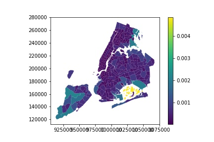

## Project Scope

 

### Navigation

1. [Home](../README.md)

2. Project Scope

3. [Data Dictionary](DataDictionary.md)

4. [Data Model](DataModel.md)

5. [ETL Design](ETLDesign.md) 

 

### 1.0 Introduction
--------------------

The NYC Taxi and Limousine Commission (TLC) are migrating their on-premise data warehouse to Amazon web services (AWS) in order to improve their analytical reporting capability. Records include fields capturing pick-up and drop-off dates/times for Yellow Taxi cabs, Green taxi cabs & for-hire vehicles (FHV) which arrive as monthly files in CSV format. Data is collected from third party technology providers who meter each vehicle and store information relating to each indiviual trip. One row represents a single trip made by a TLC-licensed vehicle.

The on premise datawarehouse is stored in Postgres v9 which is currently under high load and is stuggling to meet daily reporting requirements. A "lift and shift" to Redshift in AWS should provide improved reporting capacity and flexibility. Redshift's massively parallel processing (MPP) architecture allows for more nodes to be added as load increases. Since Redshift is derived from postgres, it should make migration easier in comparison with other vendors.

The existing ETL process is written in python and SQL using custom data transformations, with jobs scheduled using cron. TLC would like to migrate their legacy data feeds to Apache Airflow which will give better visiblity over their existing etl pipeline through the airflow UI, in addition to airflows modular architecture and extensible operators. They currently host an Apache Airflow cluster on EC2 but have plans to migrate to MWAA (Amazon Managed Workflows for Apache Airflow) at some time in the near future but this is out of scope for this project.

 

### 2.0 Acronyms and Terminology
---------------------------------

| Term            | Description                                                                                                                |
|----------------:|:--------------------------------------------------------------------------------------------------------------------------:|
| NYC             | New York City                                                                                                              |  
| TLC             | Taxi and Limousine Commission                                                                                              |
| Yellow Taxi     | New York city's medallion yellow taxis                                                                                     |
| Green Taxi      | Street Hail Livery Taxis                                                                                                   |
| FHV             | For hire Vehicles (Uber, lyft etc.)                                                                                        |
| hvFHV           | Any FHV company that does +10,000 trips a day is High volume (hvFHV)                                                       |
| Borough         | Subset of NYC region were a taxi can pick up fairs (Queens, Brooklyn, Bronx etc)                                           |
| Zone            | A borough contains smaller subsets called zones (There are 265 zones in NYC)                                               |
| Trip            | A trip is defined as an individual or group of individuals travelling between two taxi zones (May be within the same zone) |
| TSP             | Technology service provider (Vendors who monitor and record trip data)                                                     |

*Diagram shows all taxi zones in NYC*

 

### 3.0 Requirements
---------------------

#### 3.1 Current Data Volume

The new system must be able to handle the existing data volume and reporting load. Data volume and analytical workload is expected to increase over time. The system should have the flexiblity to scale with little to no downtime or administrative overhead. 

  

#### 3.1.1 Existing Data Volume

Files can vary in size between 100MB to +1GB or more. Due to COVID-19, passenger numbers have been much lower than usual for 2020. File size is expected to increase post covid due to higher demand. Files are deposited in an S3 bucket by the third party monitoring company with URI: "s3://nyc-tlc/trip data/".

4 Monthly files (Yellow, Green, FHV, hvFHV)

| FilePattern                  | FileType | NumberOfRows   | NumberOfFields | Size       | Frequency  | S3 Path Location        |
|-----------------------------:|:--------:|:--------------:|:--------------:|:----------:|:----------:|:-----------------------:|
| yellow_tripdata_YYYY-MM.csv  | CSV      | 6-20 million   | 18             | 100-600MB  | Monthly    | s3://nyc-tlc/trip data/ |
| green_tripdata_YYYY-MM.csv   | CSV      | 6-20 million   | 20             | 100-600MB  | Monthly    | s3://nyc-tlc/trip data/ |
| fhvhv_tripdata_YYYY-MM.csv   | CSV      | 1-5 million    | 7              | 100-300MB  | Monthly    | s3://nyc-tlc/trip data/ |
| fhv_tripdata_YYYY-MM.csv     | CSV      | +10 million    | 7              | +1GB       | Monthly    | s3://nyc-tlc/trip data/ |

 

#### 3.1.2 Additional datasets

| FileName                          | FilePattern    | FileType(s)    | Size               | S3 Path Location   |
|:---------------------------------:|:--------------:|:--------------:|:------------------:|:------------------:|
| Taxi Zone and Borough Shapefiles  | taxi_zones.zip | shp; shx & prj | 1MB                | s3://nyc-tlc/misc/ |

This will be a once off load that will populate the dimension tables with taxi borough/zone information. There could be a possibility of slowly changing dimensions (SCD) as area may be re-zoned or additional zones added. A fresh file may need to be loaded into the warehouse once or twice a year. The ETL should be able handle this.

 

#### 3.1.3 Other Data Sources (Uber API)

The high frequency for hire vehicle (hvFHV) data does not have any cost or pricing included. This will need to be estimated using the uber API:

[Documentation on Uber API Estimate](https://developer.uber.com/docs/riders/references/api/v1.2/estimates-price-get)

Uber uses three parameters to calculate cost

1. Base rate (time & distance)

2. Booking fee

3. Busy times/areas.

The client provides the latitude/longitude of source and destination and a price estimate is returned based on parameters mentioned.

 The call "GET /v1.2/estimates/price" can be used to roughly gauge how much the fare will cost but it may not be completely accurate. The following assumptions and limitations have been defined below:

1. Latitude and Longitude are estimated based on Zone. The centroid of the zone shapefile polygon is taken from both the starting location zone and ending location zone. This is then passed to the /v1.2/estimates/price call. If the start and end are in the same zone a flat base rate is assumed. 

2. We have no information relating to peak time or drivers availablity which would increase the price for a limited period. We are taking the same estimated pricing for all trips regardless of when they happened.

3. The booking fee can vary based on distance but we are only estimating distance so this may not be accurate.

4. There is a higher surcharge for larger SUV's in comparison with smaller vehicles. We have no information on vehicle type so the default vehicle type is assumed.

Looking at all of the above data sources, a conservative estimate of load/month would be no more than ~5G ontop of the existing DWH size (100G).

 

#### 3.2 Current Reporting load

Currently, the number of queries run against the legacy DWH is quite low. This is expected to change once the legacy environment has been fully migrated to AWS. There is a plan to use tableau for data visualisation which is expected to increase demand for analytics on the DWH. In addition, an increase in ad-hoc queries being run by analysts and data scientist is expected to increase as access to ML resources such as Sagemaker becomes available. We can assume additional CPU load many times higher than it currently is at present. This will need to be factored into the Redshift size. 

 

#### 3.3 AWS Redshift Sizing

The Redshift cluster must be able to handle the following three scenarios:

1. The data was increased by 100x - (e.g. Additional data sources were added)

2. The pipelines would be run on a daily basis by 7 am every day. (e.g. Changed from monthly loads to daily loads)

3. The database needed to be accessed by 100+ people. (Permissions within Redshift, access control)

 

#### Scenario 1: The data increased by 100x

Redshift has various options to handle rapidly increasing load. According to the AWS documentation, their recommedation is to use RA3 node types which are designed for when "Your data volume is growing rapidly or is expected to grow rapidly." RA3 nodes have 32 GB of RAM with 4 vCPU's with the ability to scale up to 16 nodes for a total of 1024TB of storage capacity. So if we assume load will increase by 100 fold over existing estimate for monthly load of 5GB/month. Then we can expect 500GB/month which would be 500X12 = 6TB per year. Hence, a RA3 node cluster will be sufficient to meet demand.

| Node size  |vCPU  |RAM (GiB) |Default slices per node | Managed storage quota per node | Node range with create cluster | Total capacity |
|:----------:|:-----|:--------:|:----------------------:|:------------------------------:|:------------------------------:|:--------------:|
| ra3.xlplus | 4    | 32       | 2                      | 32 TB1                         | 2–16                           | 1024 TB        |

[AWS Documentation on Redshift Sizing](https://docs.aws.amazon.com/redshift/latest/mgmt/working-with-clusters.html#working-with-clusters-overview)

 

#### Scenario 2: The pipelines would be run on a daily basis by 7 am every day

The ETL process is currently fixed at monthly data loads. If the data feeds were changed to daily, this would require a change within the Apache airflow ETL jobs. Simply changing the frequency from '@monthly@' to '@daily@' should be sufficient (Starting at 12am). Assuming that the total amount of load per month is not expected to change only the frequency at which the data is loaded, then this should not have an impact on the Redshift cluster size specified above. There may be implications with respect to source file naming conventions from the third party data provider, these are discussed in the ETLDesign section.

 

#### Scenario 3: The database needed to be accessed by 100+ people

This will require grouping individual users based on their specific use cases within the warehouse. At a high level there are a number of roles that we will need to plan for: 

1. Full Root Access - Full permissions (usually the account owner)

2. Administrators - SELECT, CREATE, DELETE & UPDATE access. Ability to create and drop tables, grant access, add columns, clear data from tables etc.

3. Data Analyst - SELECT only permissions. Access to all non-admin tables.

4. DevOps - Supporting role that may not have access to the database tables but may have permissions to create backups, configure networking access, security groups access etc. A Warehouse management/supporting role.

5. Business Analyst - restricted access to certain tables based on their business area. May be restricted to views only.

These may already be available as predefined policies (such as the DevOps role) but some will need to be managed internally using GRANT/REVOKE statements as we may need to restrict access to certain tables or databases. 

