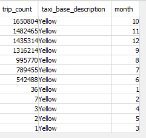
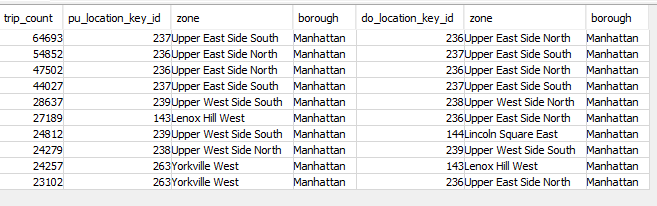

### Sample Queries
---------------------------


### Navigation

1. [Project Setup](../README.md)

2. [Project Scope](ProjectScope.md) 

3. [Data Dictionary](DataDictionary.md)

4. [Data Model](DataModel.md)

5. [ETL Design](ETLDesign.md) 

6. Sample Queries

<Br>

### Sample Queries to Validate Star Schema Design


1. Average Journey distance, duration and fair by taxi base type for March 2020

```
    
SELECT
  AVG(tf.trip_distance) as avg_trip_distance_miles,
  AVG(tf.trip_duration) as avg_trip_duration_min,
  AVG(tf.total_amount) as avg_total_amount_dollars,
  tbd.taxi_base_description,
  td1.month
FROM public.trip_fact tf
JOIN public.taxi_base_dim tbd
ON tf.taxi_base_key_id = tbd.taxi_base_key_id
JOIN public.time_dim td1
ON td1.event_datetime = tf.pickup_datetime
JOIN public.time_dim td2
ON td2.event_datetime = tf.dropoff_datetime
WHERE td1.month = 3
AND td2.month = 3
GROUP BY 
tbd.taxi_base_description,
td1.month
;
    
```
    
**Output**
    


<br>

2. Number of journeys in 2020 per month [June-December] for Yellow Taxis 


```
SELECT
  COUNT(tf.trip_key_id) as trip_count,
  tbd.taxi_base_description,
  td1.month
 FROM public.trip_fact tf
JOIN public.taxi_base_dim tbd
ON tf.taxi_base_key_id = tbd.taxi_base_key_id
JOIN public.time_dim td1
ON td1.event_datetime = tf.pickup_datetime
JOIN public.time_dim td2
ON td2.event_datetime = tf.dropoff_datetime
WHERE td1.month = td2.month
GROUP BY 
tbd.taxi_base_description,
td1.month
ORDER BY trip_count DESC
;
```

**Output**


    
<br>

3. Most popular routes for Yellow Taxi's

```
SELECT
  COUNT(tf.trip_key_id) as trip_count,
  tf.pu_location_key_id,
  ld_pu.zone,
  ld_pu.borough,
  tf.do_location_key_id,
  ld_do.zone,
  ld_do.borough
FROM public.trip_fact tf
JOIN public.location_dim ld_pu
ON ld_pu.location_key_id = tf.pu_location_key_id
JOIN public.location_dim ld_do
ON ld_do.location_key_id = tf.do_location_key_id
GROUP BY
  tf.pu_location_key_id,
  ld_pu.zone,
  ld_pu.borough,
  tf.do_location_key_id,
  ld_do.zone,
  ld_do.borough
 ORDER BY trip_count DESC
 LIMIT 10
;
```
    
