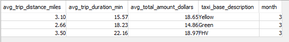

### Sample Queries
---------------------------


### Navigation

1. [Project Setup](../README.md)

2. [Project Scope](ProjectScope.md) 

3. [Data Dictionary](DataDictionary.md)

4. [Data Model](DataModel.md)

5. [ETL Design](ETLDesign.md) 

6. Sample Queries

<Br>

### Sample Queries to Validate Star Schema Design


1. Average Journey distance, duration and fair by taxi base type for March 2020

```
    
SELECT
  AVG(tf.trip_distance) as avg_trip_distance_miles,
  AVG(tf.trip_duration) as avg_trip_duration_min,
  AVG(tf.total_amount) as avg_total_amount_dollars,
  tbd.taxi_base_description,
  td1.month
FROM public.trip_fact tf
JOIN public.taxi_base_dim tbd
ON tf.taxi_base_key_id = tbd.taxi_base_key_id
JOIN public.time_dim td1
ON td1.event_datetime = tf.pickup_datetime
JOIN public.time_dim td2
ON td2.event_datetime = tf.dropoff_datetime
WHERE td1.month = 3
AND td2.month = 3
GROUP BY 
tbd.taxi_base_description,
td1.month
;
    
```
    
**Output**
    



<br>

2. Number of journeys in 2020 per month for Yellow Taxis 


```

```

<br>

3. Looking for annomalies, Unusual trips; Zero distance or zero amount

```

```